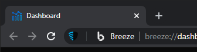

# Privacy Master Controller

Privacy Master Controller (**PMC**) is, on the surface level, an interface within [Breeze](../../../breeze-core) for quick access to useful privacy and security settings and information as well as a gateway to [`Dashboard`](../../../breeze-dashboard).

## Description

This is an integrated `browser extension` used to control **global** settings of internal privacy and security extensions<b>*</b> within Breeze as well as display the count of tracking attempts blocked per site.
Users can access these features, including [`Dashboard`](../../../breeze-dashboard), using the popup interface. 

<b>*</b> In further text, any mention of other extensions will refer to their respective implementation explained in [`Supporting Extensions`](../../../supporting-extensions).
## Interface

### Popup Elements
1. **Tracking attempts blocked on this site**
  Displays the current amount of blocked elements by `uBlock`, `Privacy Badger` and `ClearURLs` for the tab the popup is opened on.
2. **Master Toggle**
    Displays and controls the state of PMC.
    The state is defined as "in-use" if at least one toggle is active, "off" otherwise.
    If toggled while being "in-use", it will deactivate all active toggles.
    If toggled while "off", it will activate all three toggles.
    Initiates a 1s tab refresh timer upon being toggled.

3. **Privacy, Security and Cosmetic Toggles**
    * Privacy Toggle 
      Enables/Disables  `ClearURLs` and `Privacy Badger`.
      Enables/Disables the following `filter lists` [[1]](#1) in `uBlock`. 
      * [`adguard-generic`](https://filters.adtidy.org/extension/chromium/filters/2.txt)
      * [`ublock-filters`](https://raw.githubusercontent.com/uBlockOrigin/uAssets/master/filters/filters.txt)
      * [`ublock-privacy`](https://raw.githubusercontent.com/uBlockOrigin/uAssets/master/filters/privacy.txt)
      * [`adguard-spyware`](https://filters.adtidy.org/extension/ublock/filters/3.txt)
      * [`easyprivacy`](https://easylist.to/easylist/easyprivacy.txt)
      * [`ublock-unbreak`](https://raw.githubusercontent.com/uBlockOrigin/uAssets/master/filters/unbreak.txt)
    * Security Toggle 
      Enables/Disables  `HTTPs Everywhere`.
      Enables/Disables the following `filter lists` in `uBlock`.
      * [`ublock-badware`](https://raw.githubusercontent.com/uBlockOrigin/uAssets/master/filters/badware.txt)
      * [`disconnect-malvertising`](https://s3.amazonaws.com/lists.disconnect.me/simple_malvertising.txt)
      * [`malware-0`](https://gitcdn.xyz/repo/NanoMeow/MDLMirror/master/hosts.txt)
      * [`malware-1`](https://mirror.cedia.org.ec/malwaredomains/justdomains)
      * [`spam404-0`](https://raw.githubusercontent.com/Spam404/lists/master/adblock-list.txt)
      * [`ublock-abuse`](https://raw.githubusercontent.com/uBlockOrigin/uAssets/master/filters/resource-abuse.txt)
    * Cosmetic Toggle
      Enables/Disables the following `filter lists` in `uBlock`.
      * [`block-the-eu-cookie-shit-list`](https://raw.githubusercontent.com/r4vi/block-the-eu-cookie-shit-list/master/filterlist.txt)
      * [`ADBlock`](https://easylist-downloads.adblockplus.org/antiadblockfilters.txt)

    A 3s tab refresh timer is initiated upon any of the three being toggled.

4. **View Dashboard** 
Opens [`Dashboard`](../../../breeze-dashboard) (located at _breeze://dashboard_ ) in a new tab.

## Integration into Breeze
PMC is installed during the build phase of Breeze.  
This repository is used as a submodule in the [Breeze core](../../../breeze-core) repository.

The following [patches](../../../breeze-core/tree/main/patches) are used for its integration:
* [pmc-installer.patch](../../../breeze-core/blob/main/patches/core/breeze/pmc-installer.patch) 
    Sets PMC to be installed during the build process as an integrated extension, sets the appropriate tooltip and disables right-click interaction.

* [pmc-positioning.patch](../../../breeze-core/blob/main/patches/core/breeze/pmc-positioning.patch) 
    Sets the position of the PMC `browser action` [[2]](#2) to be on the left side of the `omnibox`.

    

## Permissions
Although Breeze users will not be prompted to acknowledge and accept the use of these permissions by PMC as they would with regular (e.g. Chrome Webstore) extensions due to it being an integrated extension, it is still imperative to make privacy-related information crystal clear.
These are the `permissions` [[3]](#3) required by PMC for it to work as intended:

    "permissions": [
      "storage",
      "tabs",
      "management",
      "browsingData"
    ],
   These permissions allow access to their respective APIs which PMC uses in the following way:
   
**`storage`** [[4]](#4)
- Save and load toggle values for the popup menu initialization.
- Monitor changes to toggle values for global synchronization of the popup menu.

**`tabs`** [[5]](#5)
- Perform tab queries to relay information to and from internal privacy and security extensions based on tab IDs.
- Communicate with PMC's `content script` [[6]](#6) responsible for aggregating and providing block count information for each eligible tab to the popup. 
- Create a new tab (View Dashboard).

**`management`** [[7]](#7)
- Enable/Disable internal privacy and security extensions

**`browsingData`** [[8]](#8)
- Delete `cache` and `cacheStorage` data for a specified `host`. (This happens when the aforementioned delayed refresh upon toggle interaction is initiated. The `host` is the page that was in the "background" while the toggle interaction occurred.)

## References
<a id="1">[1]</a> uBlock Wiki: [Filter lists](https://github.com/gorhill/uBlock/wiki/Dashboard:-Filter-lists)

<a id="2">[2]</a> Chrome Developers API Reference: [chrome.browserAction](https://developer.chrome.com/docs/extensions/reference/browserAction/)

<a id="3">[3]</a> Chrome Developers API Reference: [Declare permissions](https://developer.chrome.com/docs/extensions/mv2/declare_permissions/)

<a id="4">[4]</a> Chrome Developers API Reference: [chrome.storage](https://developer.chrome.com/docs/extensions/reference/storage/)

<a id="5">[5]</a> Chrome Developers API Reference: [chrome.tabs](https://developer.chrome.com/docs/extensions/reference/tabs/)

<a id="6">[6]</a> Chrome Developers API Reference: [Content scripts](https://developer.chrome.com/docs/extensions/mv2/content_scripts/)

<a id="6">[7]</a> Chrome Developers API Reference: [chrome.management](https://developer.chrome.com/docs/extensions/reference/management/)

<a id="7">[8]</a> Chrome Developers API Reference: [chrome.browsingData](https://developer.chrome.com/docs/extensions/reference/browsingData/)

## License

See [LICENSE](LICENSE)
